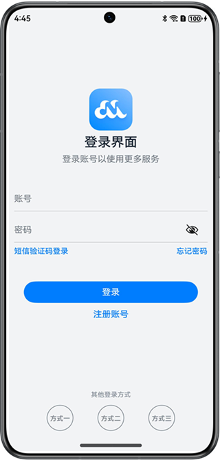
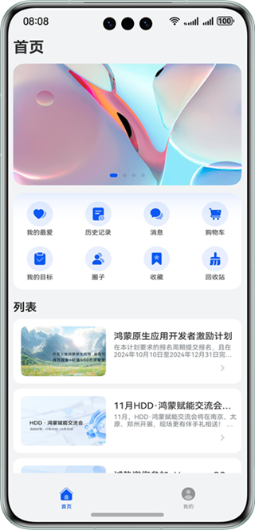
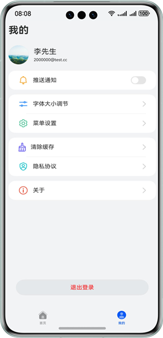
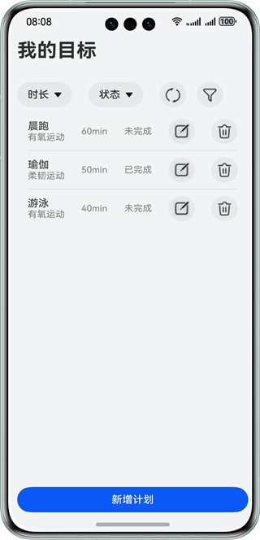

# 页面与数据

### 介绍

本实例通过使用ArkUI、ArkWeb、ArkData的一些基础能力，逐步完成了一个简单的工程，内容包括登录页面、应用页面，功能包括从网络获取资源、使用数据库保存资源等。

### 工程介绍
该工程配套鸿蒙第一课初级课程，PageAndData01配套鸿蒙第一课初级课程《从简单页面开始》，PageAndData02配套鸿蒙第一课初级课程《构建更加丰富的页面》，PageAndData03配套鸿蒙第一课初级课程《从网络获取数据》，PageAndData04配套鸿蒙第一课初级课程《保存应用数据》。
上述文件夹包含如下三部分，以PageAndData02为例，02_StartingPoint文件夹为截止到本节内容之前不包括本节内容的所有代码，用于跟随文档逐步完成。02_Resources文件夹为本节内容中需要用到的图片、文本等资源文件。02_Complete文件夹为根据本节内容逐步操作后，得到的包括之前章节内容及本节内容的代码包，便于开发者直接查看完整工程的源码。
### 效果预览

| 登录页                             | 首页                              | 设置页                               | 目标页                            |
|---------------------------------|---------------------------------|-----------------------------------|--------------------------------|
|  |  |  |  |

### 使用说明：

具体的使用方式请见鸿蒙第一课初级课程配套文档。
预览器的使用仅能查看大致预览效果，代码中涉及到了沉浸式效果开发，预览器无法展示，尽量使用模拟器\真机查看运行效果。
当前模拟器支持前两节内容（从简单页面开始、构建更加丰富的页面），从网络获取数据由于涉及网络请求，当前模拟器并不支持，建议使用真机测试。
保存应用数据涉及数据库内容，模拟器当前支持，若使用模拟器测试，由于网络章节内容模拟器不支持，首页部分内容显示不全为正常现象，但依旧建议开发者使用真机进行测试。

### 相关权限
不涉及

### 依赖
不涉及

### 约束与限制
1. 本示例仅支持标准系统上运行，支持设备：华为手机。 
2. HarmonyOS系统：HarmonyOS 5.0.0 Release及以上。 
3. DevEco Studio版本：DevEco Studio 5.0.0 Release及以上。 
4. HarmonyOS SDK版本：HarmonyOS 5.0.0 Release SDK及以上。

